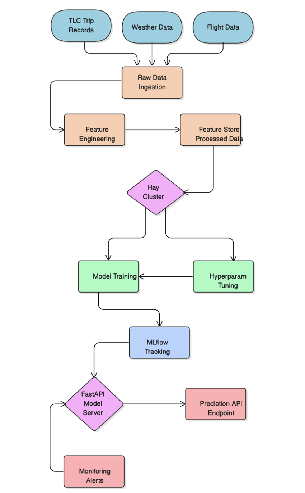
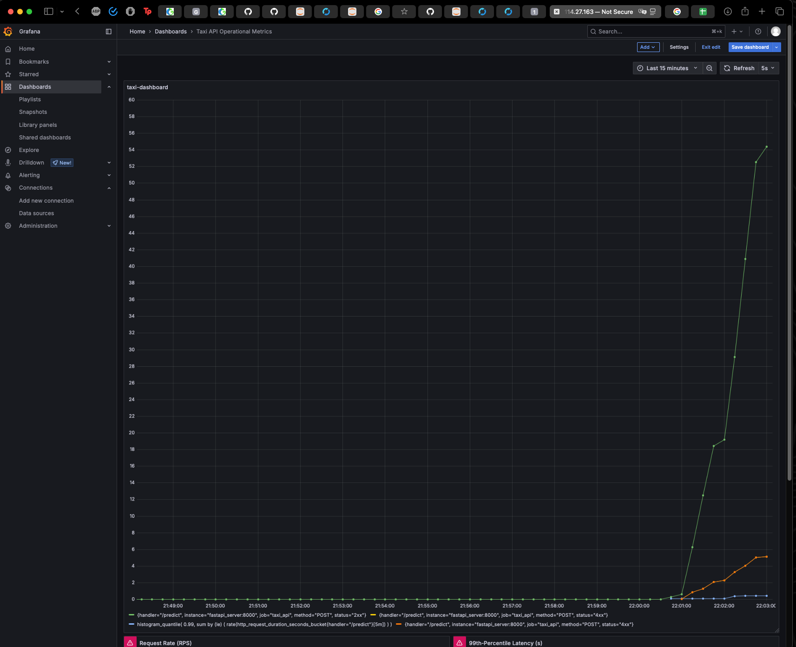
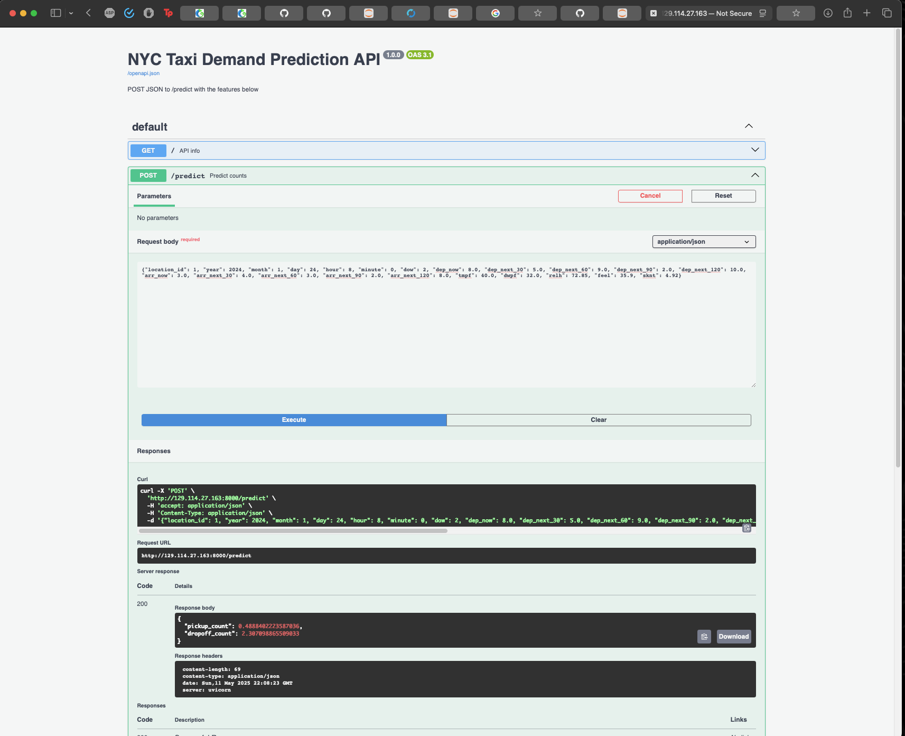
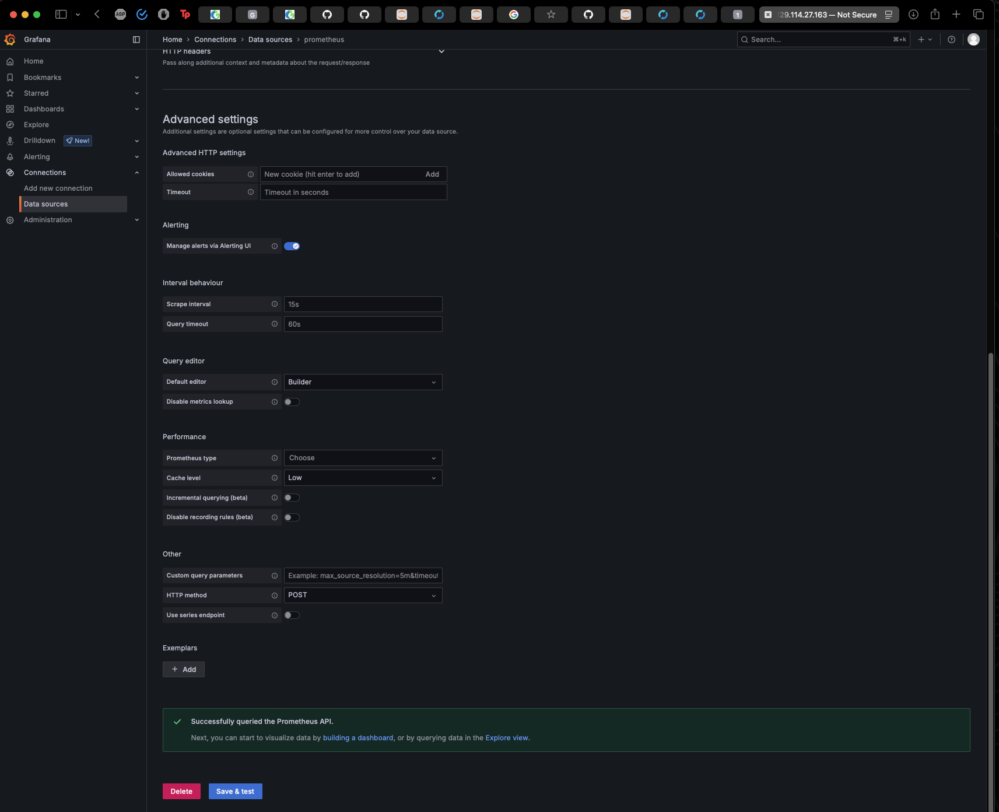

**NYC Taxi Demand Prediction with Weather and Flight Data Integration** 

**Value Proposition** 

**NYC Taxi Demand Prediction with Weather and Flight Data Integration** is a project aimed at improving urban mobility through better forecasting of taxi demand. Using historical NYC Taxi and Limousine Commission (TLC) trip records enriched with weather and flight arrival data, we will predict hourly taxi pickup counts in New York City. By anticipating surges or lulls in demand (for example, due to rain or incoming flights), taxi fleets and dispatchers can proactively allocate drivers, reducing passenger wait times and avoiding oversupply in low-demand periods. This leads to more efficient service for passengers and higher utilization for drivers, addressing urban transit needs.  

The business impact is significant i.e. better demand forecasts mean improved rider satisfaction and driver revenue, and city authorities can use these insights for traffic management. We will evaluate our models with Root Mean Square Error as the primary metric, to quantitatively measure prediction accuracy in number of trips. A lower RMSE on held-out data will indicate a better model, and this metric directly ties to business goals by representing how close our predictions are to actual taxi usage. 

**System Diagram** 

The diagram below shows the end-to-end system architecture, including data sources, the ETL pipeline, the training cluster, model registry, and the serving and monitoring components: 

Offline evaluation : Docker/Dockerfile.jupyter-onnx-cpu
Fast api : Docker/docker-compose-fastapi.yaml
Production : Docker/docker-compose-production.yaml
Airflow : airflow/docker-compose-airflow.yaml
fastapi_pt : fastapi_pt/app.py
flask_app :flask_app/app.py
Models : models/xgb_model_100.pth
Mlflow-server : mlflow-server/docker-compose-block.yaml
